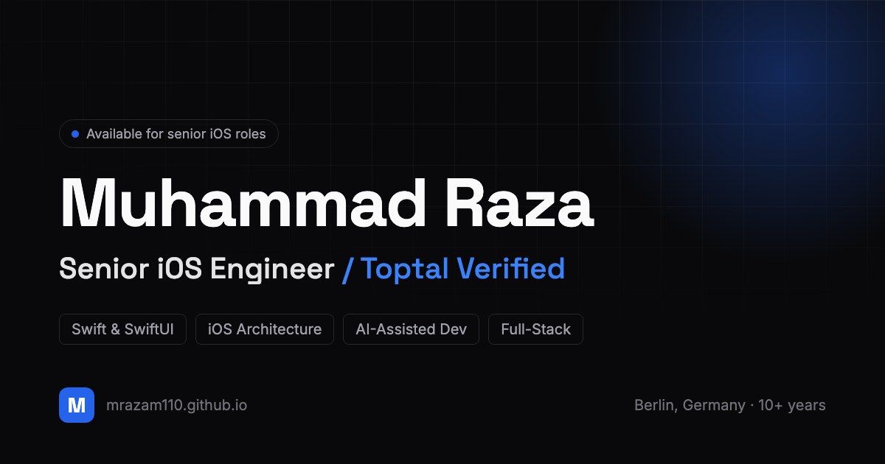

# Developer Portfolio

An open-source developer portfolio built with Next.js, TypeScript, and Tailwind.
Dark first, fast, and static. It deploys to GitHub Pages for free, and you make
it yours by editing two files.

Live: https://mrazam110.github.io



## Why this exists

Most portfolio templates either look like everyone else's or take a weekend to
customize. This one separates content from code, so you change your details in
two typed files and never touch a component. The design follows a real system
(monochrome neutrals, one accent, restrained motion) rather than a generic AI
look.

## Features

- Next.js App Router, TypeScript, Tailwind, static export
- Light and dark mode with a single accent color you can change in one line
- Sections for about, skills, experience, projects, education, certifications,
  and contact, each with an on/off toggle
- Restrained, accessible animations that respect reduced-motion
- Good SEO and social cards out of the box (Open Graph image, metadata)
- Free hosting on GitHub Pages via a ready-made GitHub Actions workflow
- Two Claude Code skills bundled in `.claude/skills` so you can keep your copy
  human and your design sharp (see Skills below)

## Make it yours (fork guide)

1. Fork this repo.
2. Rename your fork. For a personal site at `https://<you>.github.io`, name the
   repo exactly `<you>.github.io`. Any other name gives you a project site at
   `https://<you>.github.io/<repo>`, which also works.
3. Clone it and run it locally:
   ```bash
   npm install
   npm run dev
   ```
4. Edit `config/site.config.ts`: your name, role, tagline, email, social links,
   accent color, the hero rotating words, and which sections to show.
5. Edit `data/portfolio.ts`: your about text, skills, experience, projects,
   education, and certifications. The types guide you.
6. Replace the files in `public/`: `cv.pdf`, `og-image.png`, and `favicon.svg`.
7. Commit and push. In your repo, open Settings, then Pages, and set the source
   to GitHub Actions (one time). The included workflow builds and deploys on
   every push.

That is the whole loop. You should not need to edit anything under `app/` or
`components/`.

### What you edit vs. what you leave alone

| Edit these | Leave alone |
|---|---|
| `config/site.config.ts` (identity, theme, toggles) | `app/`, `components/` (the engine) |
| `data/portfolio.ts` (all content) | `next.config.js`, `tailwind.config.ts` |
| `public/` assets (cv.pdf, og-image, favicon) | `.github/workflows/deploy.yml` |

### Change the accent color

In `config/site.config.ts`, set `accentRGB` (and `accentRGBDark`) to an
`"R G B"` string. The whole palette follows. A few options:

```ts
accentRGB: '37 99 235',   // blue (default)
accentRGB: '5 150 105',   // emerald
accentRGB: '124 58 237',  // violet
```

### Hide a section

Set its toggle to `false` in `config/site.config.ts`. The section and its nav
link disappear, no code deleted:

```ts
sections: {
  certifications: false,
  // ...
}
```

## Skills bundled with this repo

Open this repo in Claude Code and these are available right away, no install.

- `/humanizer` — rewrites copy to remove AI tells. House rule it enforces: no em
  dashes. Run it on your about text and project blurbs before you publish.
- `ui-ux-pro-max` — design intelligence. Ask Claude for UI help and it picks a
  style, palette, typography, and anti-patterns for your sector. The current
  design system came from it. Spec lives in `DESIGN_SYSTEM.md`.

Both are MIT licensed and credited in `.claude/skills/CREDITS.md`.

## Local development

```bash
npm install      # install dependencies
npm run dev      # start the dev server at http://localhost:3000
npm run build    # production build and static export to ./out
```

## Tech

Next.js 15 (App Router), React 19, TypeScript, Tailwind CSS, framer-motion,
next-themes, Lucide icons.

## License

MIT. See `LICENSE`. If you use this, a link back is appreciated but not required.
